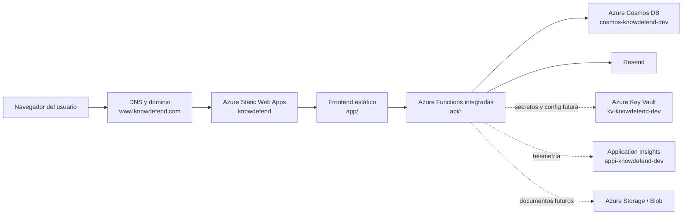
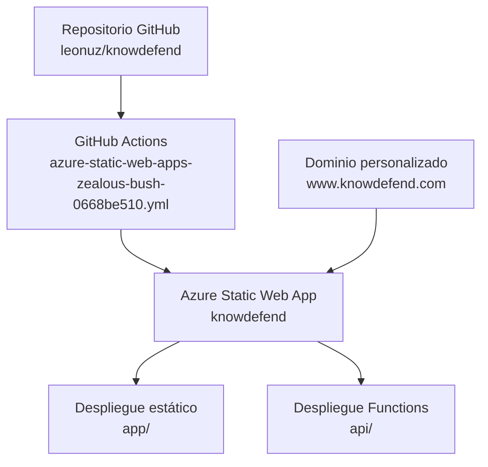
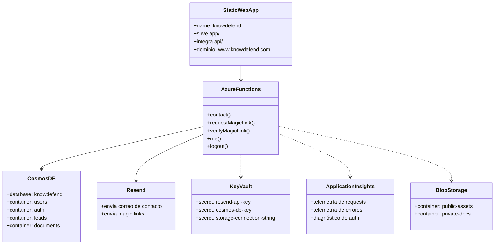
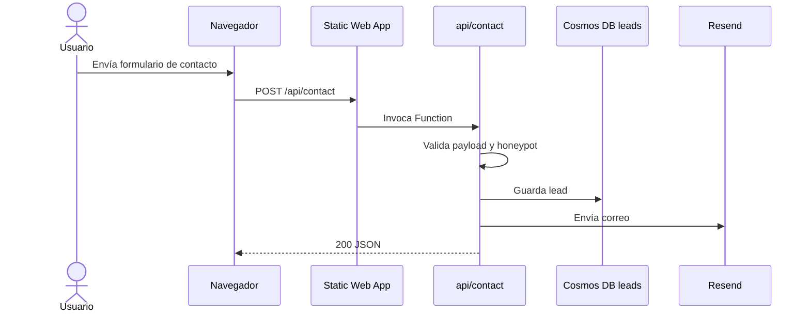
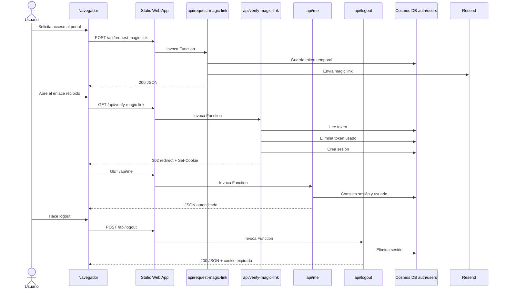
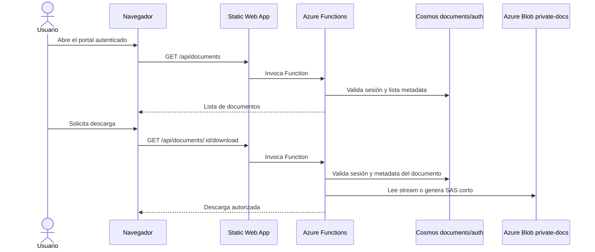

# Arquitectura V1 de KnowDefend

Este documento describe la arquitectura Azure usada actualmente por KnowDefend y los servicios ya aprovisionados para la siguiente fase.

## Superficie actualmente desplegada

- Sitio público: `https://www.knowdefend.com/`
- Portal: `https://www.knowdefend.com/portal/`
- Raíz del frontend: `app/`
- Backend serverless integrado: `api/`
- Workflow de despliegue: `.github/workflows/azure-static-web-apps-zealous-bush-0668be510.yml`

## Inventario de recursos Azure

| Servicio | Recurso Azure | Propósito | Uso actual |
|---|---|---|---|
| Azure Static Web Apps | `knowdefend` | Hospeda el sitio público y la API integrada de Functions | Activo en producción |
| Azure Functions integradas con SWA | `api/` dentro del despliegue SWA | Backend serverless para contacto, auth, consulta de sesión y logout | Activo |
| Azure Cosmos DB for NoSQL | `cosmos-knowdefend-dev` | Almacena usuarios, registros de auth, leads y metadata de documentos | Activo |
| Azure Key Vault | `kv-knowdefend-dev` | Guarda secretos operativos como API keys y connection strings | Aprovisionado |
| Azure Application Insights | `appi-knowdefend-dev` | Telemetría y diagnóstico para endurecimiento posterior | Aprovisionado |
| Azure Storage Account / Blob | storage account dev en `rg-knowdefend-dev` | Soporte de Functions y almacenamiento futuro de documentos | Aprovisionado |
| Resend | servicio externo | Envío transaccional para contacto y magic links | Activo |

## Distribución por resource groups

- `test`
  - contiene la Static Web App productiva `knowdefend`
- `rg-knowdefend-dev`
  - contiene Cosmos, Key Vault, Application Insights y Storage

Funciona técnicamente, pero más adelante conviene consolidar los recursos productivos en un solo resource group.

## Diagrama general de componentes



## Diagrama de despliegue



## Modelo UML de servicios



## Responsabilidades en runtime

### Frontend

- `app/index.html` es el sitio público principal
- `app/portal/index.html` es la entrada del portal
- `app/scripts/main.js` maneja el formulario de contacto
- `app/scripts/portal.js` maneja auth, estado de sesión y logout
- `app/staticwebapp.config.json` define headers de seguridad, rutas y fallback

### Backend

- `api/contact`
  - valida entrada
  - rechaza honeypot y payloads inválidos
  - guarda leads en Cosmos `leads`
  - envía correo por Resend
- `api/request-magic-link`
  - valida entrada
  - escribe token temporal en Cosmos `auth`
  - envía magic link por Resend
- `api/verify-magic-link`
  - valida token
  - elimina el registro del magic link usado
  - crea la sesión en Cosmos `auth`
  - setea la cookie `knowdefend_session`
  - redirige a `/portal/`
- `api/me`
  - lee la cookie de sesión
  - consulta la sesión en Cosmos
  - devuelve el estado autenticado
- `api/logout`
  - elimina la sesión
  - expira la cookie

## Diagrama de secuencia: flujo de contacto



## Diagrama de secuencia: flujo de autenticación por magic link



## Variables de entorno y límites de secretos

### Variables requeridas en Static Web App

- `APP_BASE_URL`
- `RESEND_API_KEY`
- `RESEND_FROM_EMAIL`
- `CONTACT_TO_EMAIL`
- `COSMOS_DB_ENDPOINT`
- `COSMOS_DB_KEY`
- `COSMOS_DB_DATABASE`
- `COSMOS_DB_CONTAINER_USERS`
- `COSMOS_DB_CONTAINER_AUTH`
- `COSMOS_DB_CONTAINER_LEADS`
- `COSMOS_DB_CONTAINER_DOCUMENTS`
- `SESSION_COOKIE_NAME`
- `SESSION_TTL_HOURS`
- `MAGIC_LINK_TTL_MINUTES`
- `CONTACT_THROTTLE_SECONDS`
- `MAGIC_LINK_THROTTLE_SECONDS`

### Rol de Key Vault

Key Vault debe seguir siendo la fuente de verdad para secretos sensibles, aunque por compatibilidad operativa algunos valores todavía se carguen directamente como app settings en SWA.

## Modelo de datos en Cosmos

### `users`

```json
{
  "id": "user_name@example.com",
  "type": "user",
  "email": "name@example.com",
  "name": "Name",
  "company": "Company",
  "createdAt": "2026-03-21T00:00:00.000Z",
  "updatedAt": "2026-03-21T00:00:00.000Z"
}
```

### `auth`

Magic links y sesiones comparten el mismo container y se distinguen por `type`.

```json
{
  "id": "session_xxx",
  "type": "session",
  "email": "name@example.com",
  "tokenHash": "sha256",
  "expiresAt": "2026-03-22T00:00:00.000Z",
  "ttl": 86400
}
```

### `leads`

```json
{
  "id": "lead_xxx",
  "type": "lead",
  "name": "Name",
  "email": "name@example.com",
  "company": "Company",
  "service": "ai-security",
  "message": "Need review",
  "createdAt": "2026-03-21T00:00:00.000Z"
}
```

### `documents`

```json
{
  "id": "doc_case_study_ai_guardrails",
  "visibility": "public",
  "title": "Caso de estudio de AI Guardrails",
  "slug": "ai-guardrails-case-study",
  "blobPath": "public-assets/case-studies/ai-guardrails.pdf",
  "contentType": "application/pdf",
  "tags": ["ai", "case-study"],
  "publishedAt": "2026-03-21T00:00:00.000Z"
}
```

## Estrategia propuesta para documentos privados en Blob

Sí, tiene sentido mover esta documentación interna a Blob privado y exponerla solo a usuarios autenticados.

Modelo recomendado:

- guardar los archivos reales en el container privado `private-docs`
- guardar metadata en Cosmos `documents`
- marcar cada documento con `visibility: "private"` y el `blobPath`
- no exponer nunca URLs públicas directas del blob
- crear dos endpoints nuevos:
  - `GET /api/documents` para listar documentos visibles al usuario autenticado
  - `GET /api/documents/:id/download` para validar sesión y devolver descarga autorizada

## Diagrama de acceso a documentos privados



## Notas operativas

- El sitio está vivo en la SWA heredada mientras la plataforma de datos vive en un resource group más nuevo.
- La ruta actual es suficientemente estable para v1.
- Application Insights ya existe, pero todavía falta cablear telemetría completa.
