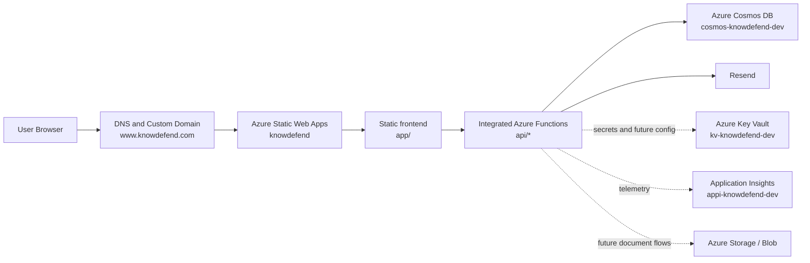
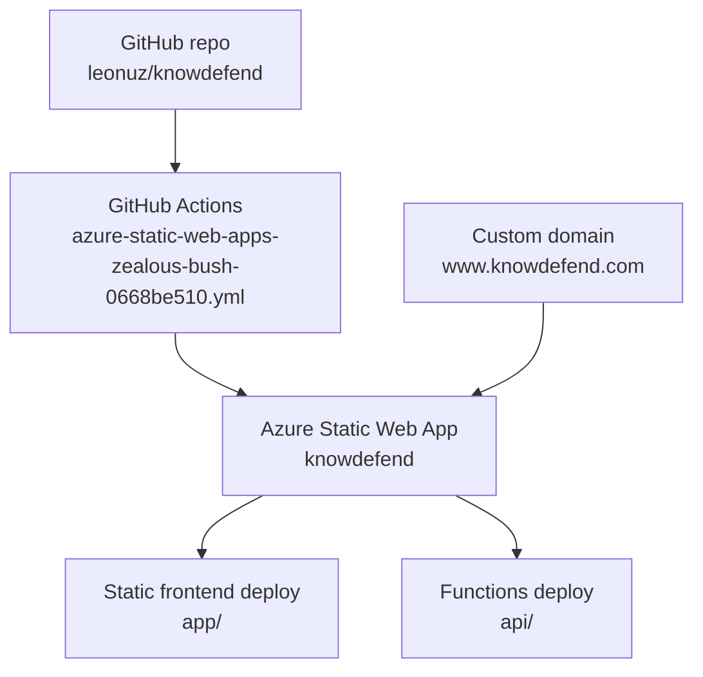
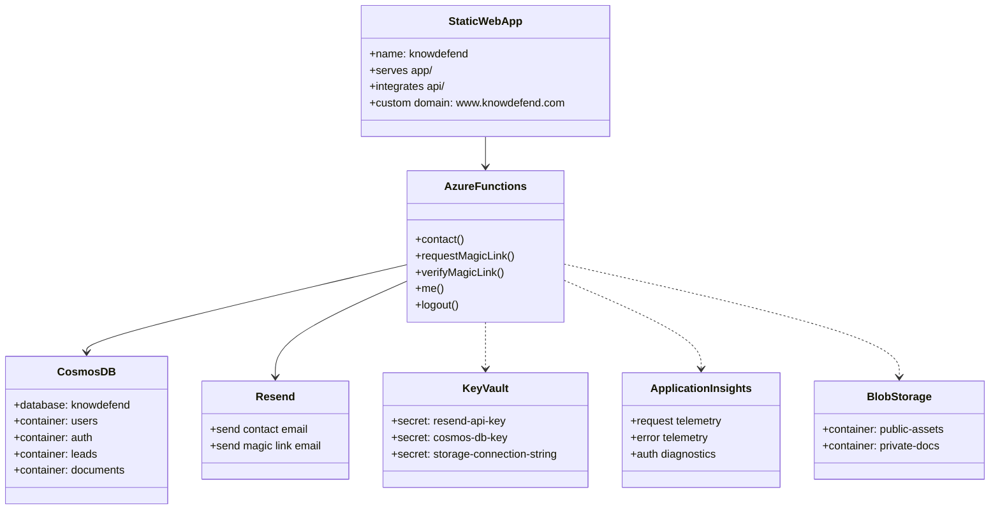
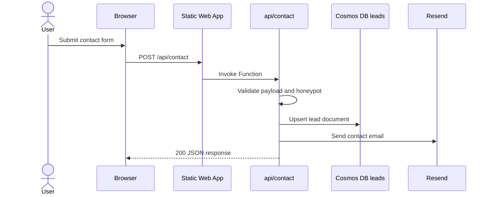
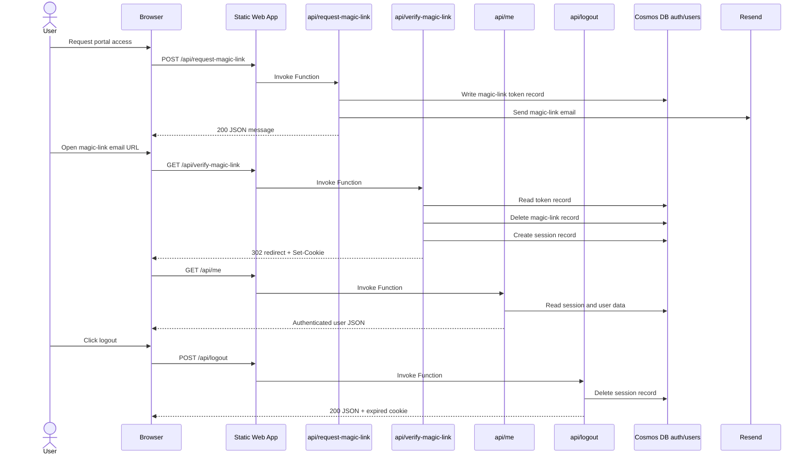

# KnowDefend V1 Architecture

This document describes the production-oriented Azure architecture currently used by KnowDefend, plus the near-term services already provisioned for the next phase.

## Current deployed surface

- Public site: `https://www.knowdefend.com/`
- Portal: `https://www.knowdefend.com/portal/`
- Frontend root: `app/`
- Integrated serverless backend: `api/`
- Deployment workflow: `.github/workflows/azure-static-web-apps-zealous-bush-0668be510.yml`

## Azure resource inventory

| Service | Azure resource | Purpose | Current usage |
|---|---|---|---|
| Azure Static Web Apps | `knowdefend` | Hosts the public site and integrated Functions API | Active production entry point |
| Azure Functions (integrated with SWA) | `api/` inside SWA deploy | Serverless backend for contact, auth, session lookup, and logout | Active |
| Azure Cosmos DB for NoSQL | `cosmos-knowdefend-dev` | Stores users, auth records, leads, and document metadata | Active |
| Azure Key Vault | `kv-knowdefend-dev` | Stores operational secrets such as API keys and connection strings | Provisioned |
| Azure Application Insights | `appi-knowdefend-dev` | Telemetry and diagnostics target for future hardening | Provisioned |
| Azure Storage Account / Blob | dev storage account in `rg-knowdefend-dev` | Required for Functions storage and future document containers | Provisioned for platform use; Blob content strategy is planned |
| Resend | external service | Transactional delivery for contact and magic-link email | Active |

## Resource group layout

- `test`
  - contains the existing production-facing Static Web App `knowdefend`
- `rg-knowdefend-dev`
  - contains the newer supporting platform resources for Cosmos, Key Vault, Application Insights, and storage

This split works technically, but it is an operational compromise. A later cleanup should consolidate production resources into a single production resource group.

## High-level component diagram



## Deployment diagram



## UML-style service model



## Runtime responsibilities

### Frontend

- `app/index.html` is the public marketing site
- `app/portal/index.html` is the portal entry point
- `app/scripts/main.js` handles the contact form
- `app/scripts/portal.js` handles auth state, magic-link requests, and logout
- `app/staticwebapp.config.json` defines security headers, routing, and navigation fallback

### Backend

- `api/contact`
  - validates input
  - rejects honeypot/bad payloads
  - stores lead records in Cosmos `leads`
  - sends notification email through Resend
- `api/request-magic-link`
  - validates user input
  - writes a short-lived magic-link token to Cosmos `auth`
  - emails the login URL through Resend
- `api/verify-magic-link`
  - validates the token
  - deletes the used magic-link record
  - creates a session record in Cosmos `auth`
  - sets the `knowdefend_session` cookie
  - redirects back to `/portal/`
- `api/me`
  - reads the session cookie
  - looks up the session in Cosmos
  - returns the authenticated user state
- `api/logout`
  - deletes the session record
  - expires the cookie

## Sequence diagram: contact flow



## Sequence diagram: magic-link authentication flow



## Environment and secret boundaries

### Static Web App application settings

These values are required in SWA environment variables:

- `APP_BASE_URL`
- `RESEND_API_KEY`
- `RESEND_FROM_EMAIL`
- `CONTACT_TO_EMAIL`
- `COSMOS_DB_ENDPOINT`
- `COSMOS_DB_KEY`
- `COSMOS_DB_DATABASE`
- `COSMOS_DB_CONTAINER_USERS`
- `COSMOS_DB_CONTAINER_AUTH`
- `COSMOS_DB_CONTAINER_LEADS`
- `COSMOS_DB_CONTAINER_DOCUMENTS`
- `SESSION_COOKIE_NAME`
- `SESSION_TTL_HOURS`
- `MAGIC_LINK_TTL_MINUTES`
- `CONTACT_THROTTLE_SECONDS`
- `MAGIC_LINK_THROTTLE_SECONDS`

### Key Vault role

Key Vault currently acts as the secret source of record for sensitive values, even if some settings are still entered directly into SWA environment variables for compatibility and operational simplicity.

## Cosmos data model

### `users`

```json
{
  "id": "user_name@example.com",
  "type": "user",
  "email": "name@example.com",
  "name": "Name",
  "company": "Company",
  "createdAt": "2026-03-21T00:00:00.000Z",
  "updatedAt": "2026-03-21T00:00:00.000Z"
}
```

### `auth`

Magic-link and session records share the same container and are separated by `type`.

```json
{
  "id": "session_xxx",
  "type": "session",
  "email": "name@example.com",
  "tokenHash": "sha256",
  "expiresAt": "2026-03-22T00:00:00.000Z",
  "ttl": 86400
}
```

### `leads`

```json
{
  "id": "lead_xxx",
  "type": "lead",
  "name": "Name",
  "email": "name@example.com",
  "company": "Company",
  "service": "ai-security",
  "message": "Need review",
  "createdAt": "2026-03-21T00:00:00.000Z"
}
```

### `documents`

```json
{
  "id": "doc_case_study_ai_guardrails",
  "visibility": "public",
  "title": "AI Guardrails Case Study",
  "slug": "ai-guardrails-case-study",
  "blobPath": "public-assets/case-studies/ai-guardrails.pdf",
  "contentType": "application/pdf",
  "tags": ["ai", "case-study"],
  "publishedAt": "2026-03-21T00:00:00.000Z"
}
```

## Future Blob storage model

Keep site branding inside `app/assets/`.

Use Blob Storage for:

- public case studies
- brochures
- technical sheets
- private client documents
- future customer uploads

Suggested containers:

- `public-assets`
- `private-docs`

## Operational notes

- The site is live on the legacy SWA resource while newer data-platform resources live in a newer resource group.
- The current production path is stable enough for v1, but infrastructure consolidation is still worth doing.
- Application Insights is provisioned, but telemetry wiring should be completed in the next hardening pass.
